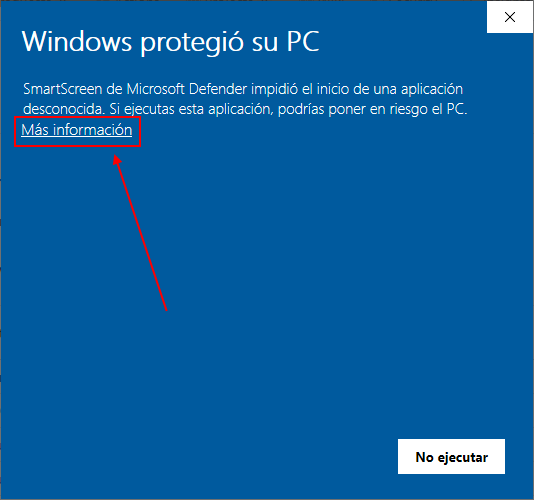

# Bling desktop
This application is the container of [Bling Viewer](https://github.com/lurume84/bling-viewer) project. It is a chrome-based application (CEF) that loads viewer seamlessly and provides local storage capabilities.

## What it does

* Live View
* Synchronize all videos in local storage
* Periodic snapshots synchronized in local storage
* Upgrades to last official Bling Viewer automatically
* Disables CORS to allow connection with Blink Servers

## What it will do

* Notify user of movement using Windows Toast Notifications (WIP)

## Installation
1. Go to Releases section

2. Click on the first BlingSetup.exe that appears

3. Click on the downloaded executable

4. This warning may appear because of the installer comes from Internet without a trusted source. Click on more information and execute

5. Click next to everything and install

6. Go to your desktop and execute. From this point everything is automated, desktop will download latest viewer and a login form will appear. Put your credentials and application should appear.

## Usage
This application automatically creates folder %userprofile%/Documents/Bling.exe. This folder contains all user-related information that is described below

### CrashReports
In case application crashes, a dump will be generated inside this folder. If you want to contribute to its resolution send it to me.

### Download
Videos, Thumbnails and github releases will be downloaded here. To force a redownload of viewer just delete versions folder and open application again.

### Html
Contains the downloaded viewer. This is automatically stepped over by viewer updates, also contains your connection token. In case you want to remove credentials remove token.json file.

### Blink.ini
This is the file you need to modify to configure your desktop application.

* SyncVideo
  * Enabled: By default this is enabled. It tells the application to poll Blink servers for new videos
  * UseLocalTime: By default this is disabled. Saves each video in your computer's timezone instead of UTC.
  * Interval: By default this is 60 seconds. The time to sleep until checking again Blink servers. Do not put a small value to avoid flooding Blink servers. Since desktop is thought to be always opened a check each minute is more than enough.
  * Sleep: By default this is 20 seconds. The time to sleep between each video download. This means 3 videos per minute. Again, do not put a small value here.
  * Output: By default this is %userprofile%/Documents/Download/Videos. The folder where videos will be downloaded. Put any path you want, even network locations should work. In case they give you problems, map them in Windows so they can be accessed by a drive letter.
  * LastUpdate: This is automatically generated. It is the timestamp of the last successful video download. It is used to speed up video downloads so we know when last video was downloaded. In case you delete videos folder you will have to remove this value too.
* SyncThumbnail
  * Enabled: By default this is disabled. It tells the application to poll Blink servers for a new snapshot for each camera.
  * Interval: By default this is 3600 seconds (1 hour). The time to sleep until polling again Blink servers. Do not put a small value to avoid flooding Blink servers
  * Sleep: By default this is 5 seconds. The time to sleep until checking again if snapshot has been successful.
  * Retries: By default this is 10. Number of times to check if snapshot was successful. Combined with sleep, this means we will wait 50 seconds to consider snapshot was unsuccessful.
  * Output: By default this is %userprofile%/Documents/Download/Thumbnails.
* LiveView
  * Output: By default this is %userprofile%/Documents/Download/Videos.
  * UseLocalTime: By default this is disabled. Saves each video in your computer's timezone instead of UTC.
  * Endpoint: By default this is http://127.0.0.1:9192. Change port in case you have another application using it.

* Example

[SyncVideo]

Enabled=true

UseLocalTime=false

Interval=60

Sleep=20

Output=D:\Videos

[SyncThumbnail]

Enabled=false

Interval=3600

Sleep=5

Retries=10

Output=D:\Thumbnails

## Development Guide
You need vs2017. Checkout and uncompress third_party.7z in the same folder.

## Compatibility
Only Windows 10 is fully supported at this time due to Toast Notifications. Windows 7 also works but without notifications system. In practice, this only means you need to manually update viewer by deleting %userprofile%/Documents/Html/viewer folder and starting application again.
